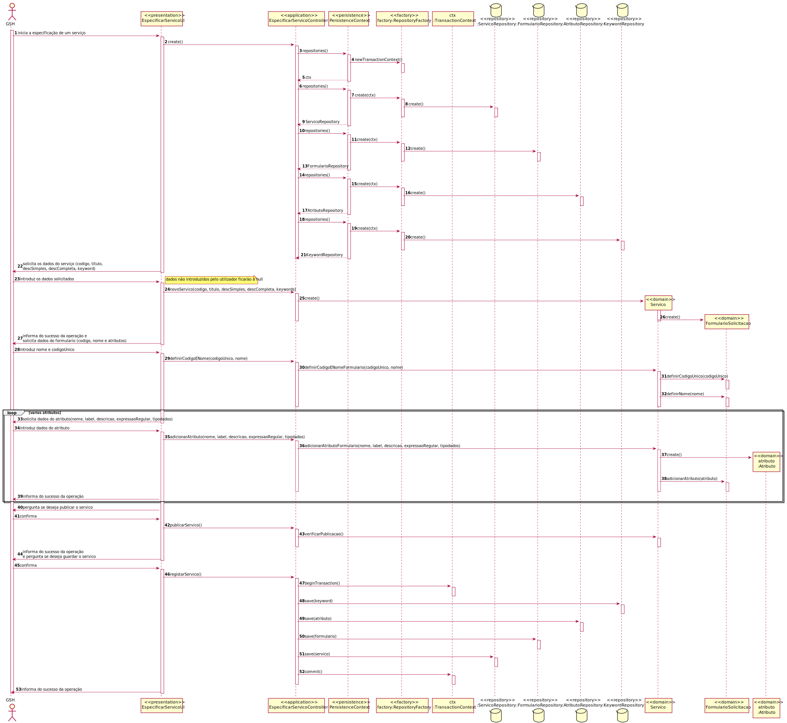
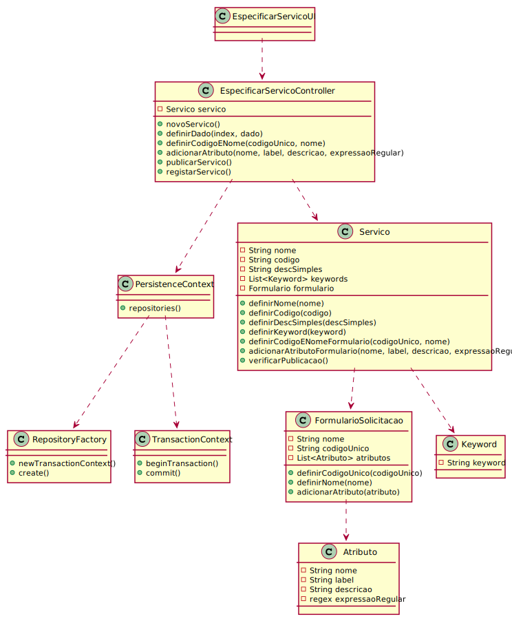

# 2002.1 - Como GSH, eu pretendo proceder à especificação de um novo serviço
=======================================

# 1. Requisitos

**2002:** Como Gestor de Serviços de Helpdesk pretendo...

- 2002.1: especificar um novo serviço de forma completa.

- 2002.2: especificar um novo serviço de forma incompleta.

A interpretação feita deste requisito foi no sentido de efetuar a especificação de um serviço novo com os seus dados (Código, Titulo, Descrição Simples, Descrição Completa, Keywords e Ícone), podendo interromper a sua especificação.

# 2. Análise

O modelo de dominio desta funcionalidade não se diferencia do geral do projeto, não sendo assim necessária uma reavaliação do mesmo.

# 3. Design

## 3.1. Realização da Funcionalidade

## 3.2. Diagrama de Classes

## 3.3. Padrões Aplicados

/-

## 3.4. Testes 
*Testes ao controller não forem efetuados devido à necessidade de conexão à base de dados.*

**Teste Servico:** testes da classe Servico.

    public void testDefinirCodigoeNomeFormulario() {
        Keyword a = new Keyword("ola");
        Keyword b = new Keyword("rui");
        Keyword c = new Keyword("<3>");

        List<Keyword> lista = new ArrayList<>();
        lista.add(a);
        lista.add(b);
        lista.add(c);

        Servico servico = new Servico("teste", "teste", "teste", "teste", lista);

        Formulario exp = new Formulario();

        servico.definirCodigoeNomeFormulario("codigo", "nome");

        Formulario act = servico.formulario();

        assertNotSame(exp, act);

        exp.definirNome("nome");
        exp.definirCodigoUnico("codigo");

        assertEquals(exp, act);
    }

    public void testAdicionarAtributoFormulario() {
        Keyword a = new Keyword("ola");
        Keyword b = new Keyword("rui");
        Keyword c = new Keyword("<3>");

        List<Keyword> lista = new ArrayList<>();
        lista.add(a);
        lista.add(b);
        lista.add(c);

        Servico servico = new Servico("teste", "teste", "teste", "teste", lista);

        Atributo act = servico.adicionarAtributoFormulario("teste", "teste", "teste", "teste", "dado");

        Atributo exp = new Atributo("teste", "teste", "teste", "teste", "dado");

        assertEquals(exp, act);

        exp = new Atributo("d", "teste", "teste", "teste", "dado");

        assertNotSame(exp, act);
    }

    public void testFormulario() {
        Keyword a = new Keyword("ola");
        Keyword b = new Keyword("rui");
        Keyword c = new Keyword("<3>");

        List<Keyword> lista = new ArrayList<>();
        lista.add(a);
        lista.add(b);
        lista.add(c);

        Servico servico = new Servico("teste", "teste", "teste", "teste", lista);

        Formulario act = servico.formulario();

        List<Atributo> atributos = new ArrayList<>();

        Formulario exp = new Formulario();

        assertEquals(exp, act);

        servico.definirCodigoeNomeFormulario("codigo", "nome");

        exp.definirCodigoUnico("codigo");
        exp.definirNome("nome");

        assertEquals(exp, act);
    }

    public void testVerificarPublicacao() {
        Keyword a = new Keyword("ola");
        Keyword b = new Keyword("rui");
        Keyword c = new Keyword("<3>");

        List<Keyword> lista = new ArrayList<>();
        lista.add(a);
        lista.add(b);
        lista.add(c);

        Servico servico = new Servico("teste", "", "teste", "teste", lista);

        assertFalse(servico.verificarPublicacao());

        servico = new Servico("teste", "teste", "teste", "teste", lista);

        assertFalse(servico.verificarPublicacao());

        servico.definirCodigoeNomeFormulario("codigo", "nome");

        assertFalse(servico.verificarPublicacao());

        servico.adicionarAtributoFormulario("teste", "teste", "teste", "teste", "dado");

        assertTrue(servico.verificarPublicacao());
    }

    public void testTestToString() {
        Keyword a = new Keyword("ola");
        Keyword b = new Keyword("rui");
        Keyword c = new Keyword("<3>");

        List<Keyword> lista = new ArrayList<>();
        lista.add(a);
        lista.add(b);
        lista.add(c);

        Servico servico = new Servico("teste", "teste", "teste", "teste", lista);

        assertEquals("teste | teste : Serviço ainda não disponível.", servico.toString());

        servico.definirCodigoeNomeFormulario("codigo", "nome");

        servico.adicionarAtributoFormulario("teste", "teste", "teste", "teste", "dado");

        servico.verificarPublicacao();

        assertEquals("teste | teste\n" +
                "teste\n" +
                "teste", servico.toString());
    }

    public void testTestEquals() {
        Keyword a = new Keyword("ola");
        Keyword b = new Keyword("rui");
        Keyword c = new Keyword("<3>");

        List<Keyword> lista = new ArrayList<>();
        lista.add(a);
        lista.add(b);
        lista.add(c);

        Servico servico = new Servico("teste", "teste", "teste", "teste", lista);

        Servico servico2 = new Servico("ok", "teste", "teste", "teste", lista);

        assertFalse(servico.equals(servico2));

        servico2 = new Servico("teste", "teste", "teste", "teste", lista);

        assertTrue(servico.equals(servico2));
    }

**Teste Formulario:** testes da classe Formulario.

    public void testAdicionarAtributo() {
        Formulario form = new Formulario();

        Atributo atributo = new Atributo("teste", "teste", "teste", "teste", "dado");

        List<Atributo> atributos = new ArrayList<>();

        assertNotSame(atributos, form.atributos());

        atributos.add(atributo);

        form.adicionarAtributo(atributo);

        assertEquals(atributos, form.atributos());
    }

    public void testVerificarPublicacao() {
        Formulario form = new Formulario();

        assertFalse(form.verificarPublicacao());

        form.definirNome("a");
        form.definirCodigoUnico("b");

        Atributo atributo = new Atributo("teste", "teste", "teste", "teste", "dado");

        form.adicionarAtributo(atributo);

        assertTrue(form.verificarPublicacao());
    }

    public void testTestEquals() {
        Formulario form = new Formulario();

        Formulario form2 = new Formulario();

        assertTrue(form.equals(form2));

        form.definirNome("a");
        form.definirCodigoUnico("b");

        Atributo atributo = new Atributo("teste", "teste", "teste", "teste", "dado");

        form.adicionarAtributo(atributo);

        assertFalse(form.equals(form2));
    }

**Teste Atributo:** testes da classe Atributo.

    public void testTestEquals() {
        Atributo exp = new Atributo("teste", "teste", "teste", "teste", "dado");

        Atributo act = new Atributo("teste", "teste", "teste", "teste", "dado");

        assertTrue(exp.equals(act));

        act = new Atributo("o", "teste", "teste", "teste", "dado");

        assertFalse(exp.equals(act));
    }

    public void testTestToString() {
        Atributo exp = new Atributo("teste", "teste", "teste", "teste", "dado");

        assertEquals("teste | teste | Tipo de dados: dado\n" +
                "Descrição: teste", exp.toString());
    }

# 4. Implementação

/-

# 5. Integração/Demonstração

- Esta funcionalidade funciona de forma independente das restantes

# 6. Observações

- A funcionalidade foi realizada com sucesso
- No futuro será desenvolvida a funcionalidade editar um serviço que não foi registado por completo

