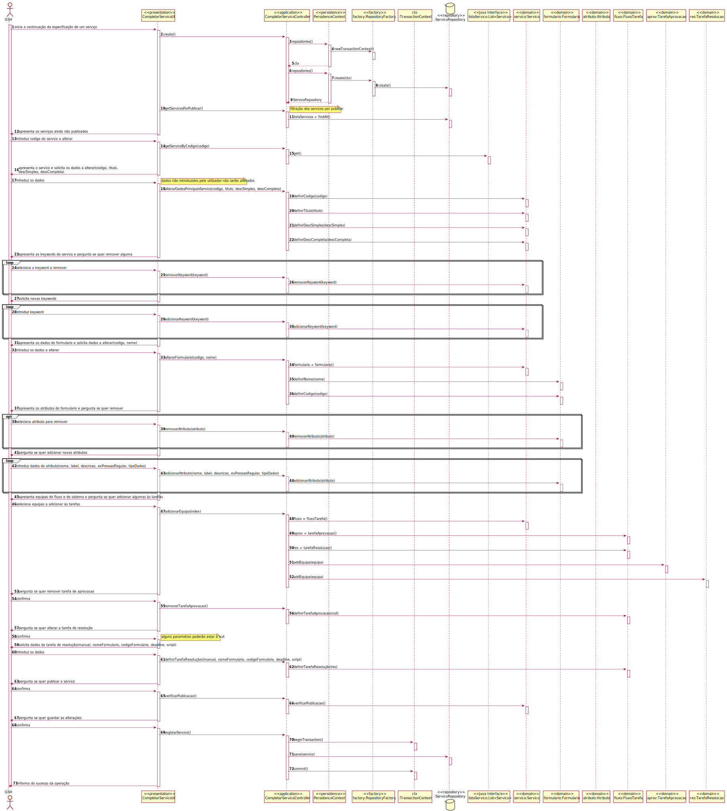
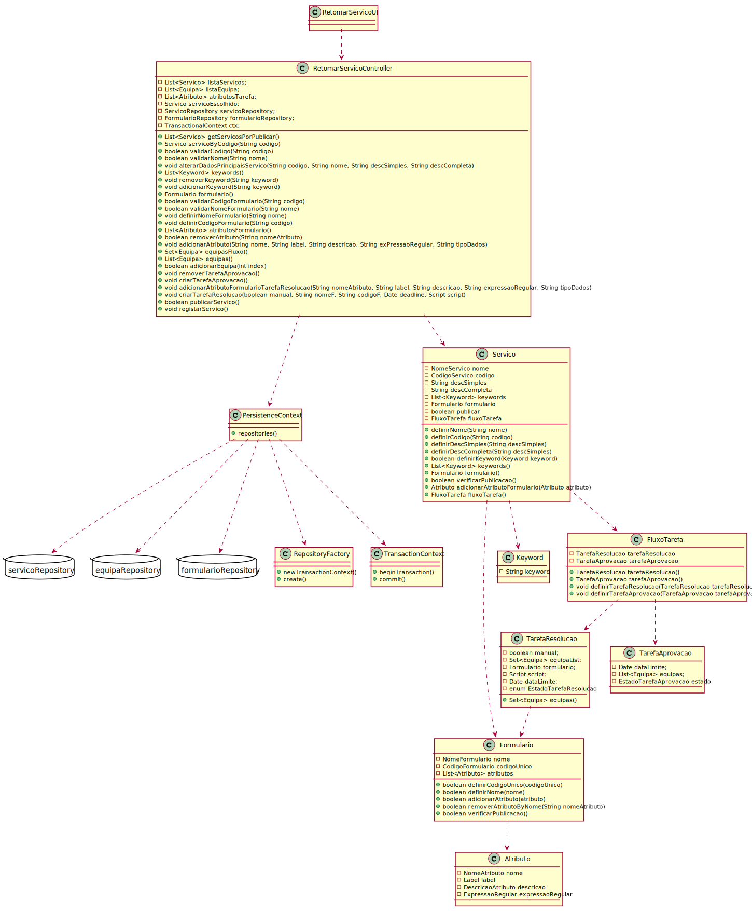

# 2002.1 - Como GSH, eu pretendo proceder à especificação de um novo serviço
=======================================

# 1. Requisitos

**2003:** Como Gestor de Serviços de Helpdesk pretendo...

- 2003.1: continuar/completar a especificação em curso de um serviço.

A interpretação feita deste requisito foi no sentido de continuar / completar a especificação de um serviço alterando ou adicionando algum dado a um serviço previamente iniciado.

# 2. Análise

O modelo de dominio desta funcionalidade não se diferencia do geral do projeto, não sendo assim necessária uma reavaliação do mesmo.

# 3. Design

## 3.1. Realização da Funcionalidade

## 3.2. Diagrama de Classes

## 3.3. Padrões Aplicados

/-

## 3.4. Testes 
*Testes ao controller não forem efetuados devido à necessidade de conexão à base de dados.*

# 4. Implementação

/-

# 5. Integração/Demonstração

- Esta funcionalidade necessita da existência de serviços no sistema

# 6. Observações

- A funcionalidade não foi realizada com sucesso devido a um erro aquando da gravação da edição do serviço. A equipa trabalhará de forma a resolver esse e outros possiveis erros.

