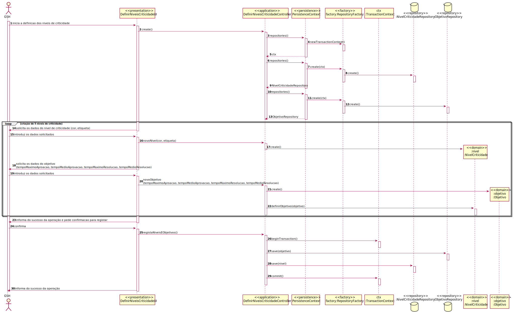
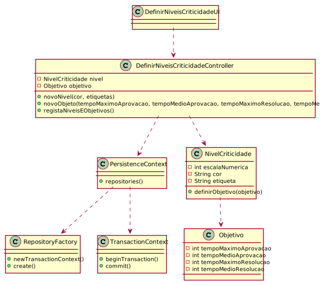

# 2010 - Como GSH, eu pretendo definir os niveis de criticidade e respetivos objetivos aplicados na organização para definição de SLAs
=======================================

# 1. Requisitos

**2010:** Como Gestor de Serviços de Helpdesk pretendo...

- 2010.1: definir os niveis de criticidade e respetivos objetivos aplicados na organização para definição de SLAs.

A interpretação feita deste requisito foi no sentido de definir niveis de criticidade e respetivos objetivos aplicados na organização de modo a serem definidos nos SLAs

# 2. Análise

O modelo de dominio desta funcionalidade não se diferencia do geral do projeto, não sendo assim necessária uma reavaliação do mesmo.

# 3. Design

## 3.1. Realização da Funcionalidade

## 3.2. Diagrama de Classes

## 3.3. Padrões Aplicados

/-

## 3.4. Testes 
*Testes ao controller não forem efetuados devido à necessidade de conexão à base de dados.*

**Teste NivelCriticidade:** testes da classe NivelCriticidade.

	public void testDefinirObjetivo() {
        NivelCriticidade nivel = new NivelCriticidade(1, "cor","label");

        Objetivo obj = new Objetivo(100, 100, 100, 100);

        nivel.definirObjetivo(obj);

        assertTrue(nivel.objetivo().equals(obj));
    }

    public void testObjetivo() {
        NivelCriticidade nivel = new NivelCriticidade(1, "cor","label");

        Objetivo obj = new Objetivo(100, 100, 100, 100);

        nivel.definirObjetivo(obj);

        assertTrue(nivel.objetivo().equals(obj));
    }

# 4. Implementação

/-

# 5. Integração/Demonstração

- Esta funcionalidade funciona de forma independente das restantes

# 6. Observações

- A funcionalidade foi realizada com sucesso

