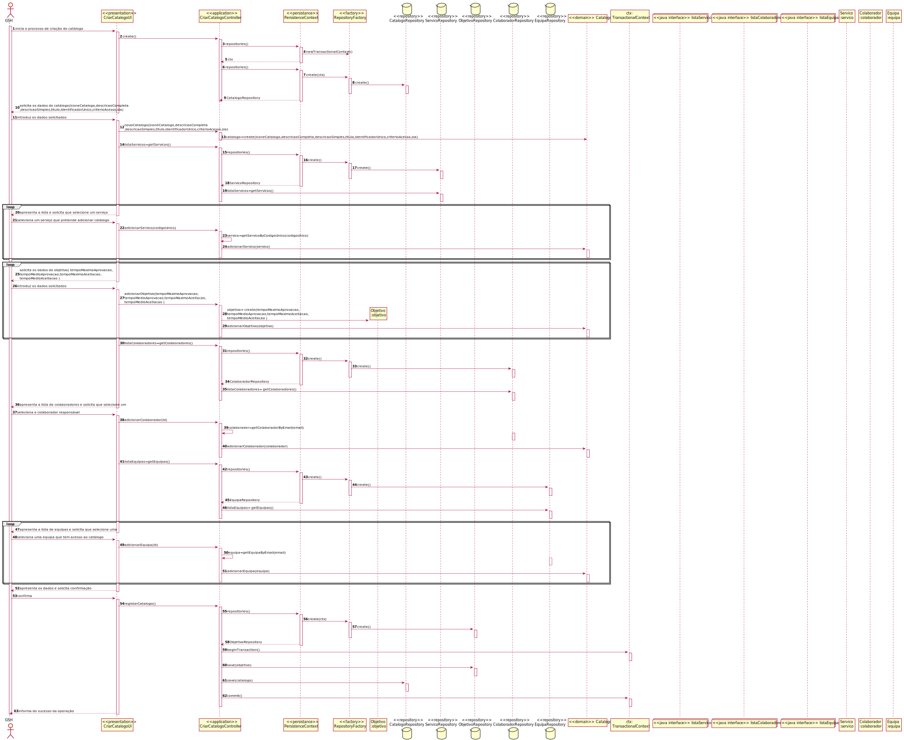
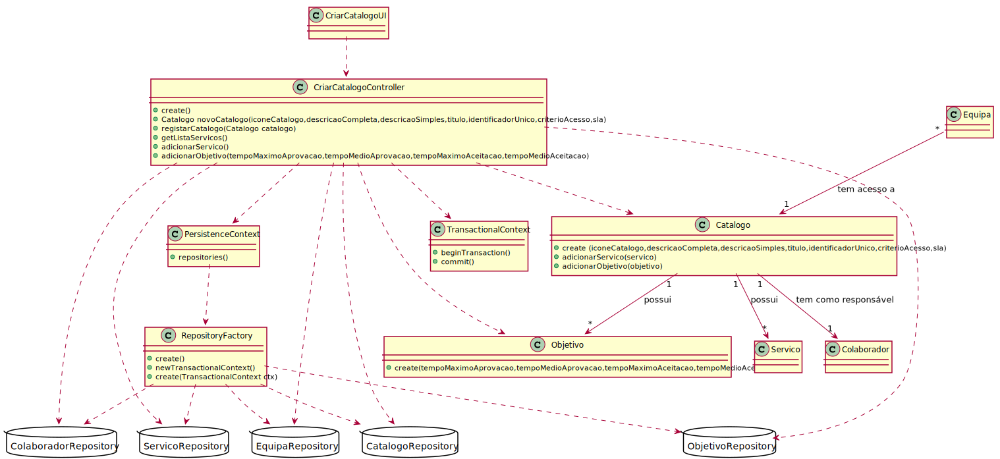

# US2001
=======================================

# 1. Requisitos

**US2001** Como {Gestor de Serviços de Help desk (GSH)} pretendo...

- US2001.1. Criar um novo catálogo de serviços

# 2. Análise

*Neste secção a equipa deve relatar o estudo/análise/comparação que fez com o intuito de tomar as melhores opções de design para a funcionalidade bem como aplicar diagramas/artefactos de análise adequados.*

*Recomenda-se que organize este conteúdo por subsecções.*

# 3. Design

*Nesta secção a equipa deve descrever o design adotado para satisfazer a funcionalidade. Entre outros, a equipa deve apresentar diagrama(s) de realização da funcionalidade, diagrama(s) de classes, identificação de padrões aplicados e quais foram os principais testes especificados para validar a funcionalidade.*

*Para além das secções sugeridas, podem ser incluídas outras.*

## 3.1. Realização da Funcionalidade

## 3.2. Diagrama de Classes

## 3.3. Padrões Aplicados

*Nesta secção deve apresentar e explicar quais e como foram os padrões de design aplicados e as melhores práticas.*

## 3.4. Testes
*Nesta secção deve sistematizar como os testes foram concebidos para permitir uma correta aferição da satisfação dos requisitos.*

**Teste 1:** Verificar que é possível adicionar um serviço ao Catálogo .

	@Test
			public void testAdicionarServico() {
				System.out.println("Teste adicionar objetivo ao servico");
				Catalogo catalogo= new Catalogo("Icone","Descricao Completa","Descricao Simples","Titulo","Identificador Unico","Criterio acesso",new SLA("Contrato"));
				List<Keyword> keywords= new ArrayList<>();
				catalogo.adicionarServico(new Servico("Nome", "codigo", "descSimples","descCompleta", keywords));
				Servico expResult= new Servico("Nome", "codigo", "descSimples","descCompleta", keywords);
				assertEquals(expResult,catalogo.servicos().get(0));
				}

# 4. Implementação

*Nesta secção a equipa deve providenciar, se necessário, algumas evidências de que a implementação está em conformidade com o design efetuado. Para além disso, deve mencionar/descrever a existência de outros ficheiros (e.g. de configuração) relevantes e destacar commits relevantes;*

*Recomenda-se que organize este conteúdo por subsecções.*

# 5. Integração/Demonstração

Neste US foi necessário trabalhar com repositórios de outras US tais como ServicoRepository, EquipaRepository e ColaboradorRepository, fazendo se esta ligação através do controller que usa a persistence para aceder à Repository factory e aos respetivos repositórios.

# 6. Observações

*Nesta secção sugere-se que a equipa apresente uma perspetiva critica sobre o trabalho desenvolvido apontando, por exemplo, outras alternativas e ou trabalhos futuros relacionados.*
