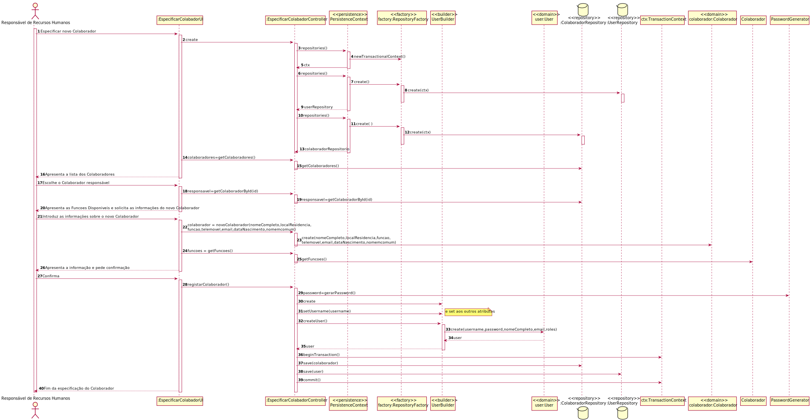
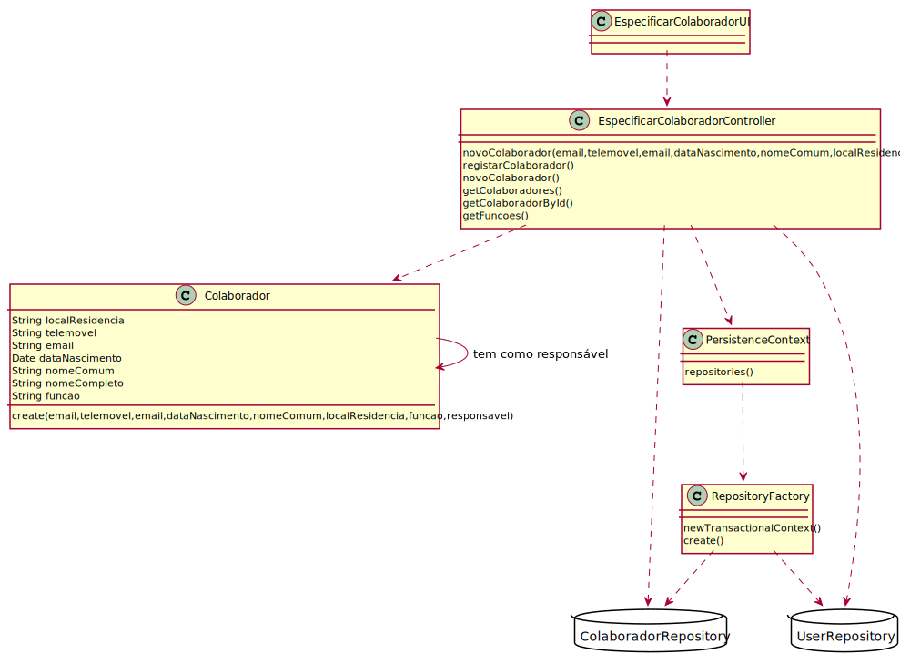

# US2051
=======================================

# 1. Requisitos

*Nesta secção a equipa deve indicar a funcionalidade desenvolvida bem como descrever a sua interpretação sobre a mesma e sua correlação e/ou dependência de/com outros requisitos.*

**2051** Como Responsável de Recursos Humanos pretendo proceder à especificação de um novo colaborador de modo a que este possa, posteriormente, aceder e usar o sistema.

- 2051.1. Adicionar colaborador

# 2. Análise

# 3. Design

*Nesta secção a equipa deve descrever o design adotado para satisfazer a funcionalidade. Entre outros, a equipa deve apresentar diagrama(s) de realização da funcionalidade, diagrama(s) de classes, identificação de padrões aplicados e quais foram os principais testes especificados para validar a funcionalidade.*

*Para além das secções sugeridas, podem ser incluídas outras.*

## 3.1. Realização da Funcionalidade

## 3.2. Diagrama de Classes

## 3.3. Padrões Aplicados

*Nesta secção deve apresentar e explicar quais e como foram os padrões de design aplicados e as melhores práticas.*

## 3.4. Testes
*Nesta secção deve sistematizar como os testes foram concebidos para permitir uma correta aferição da satisfação dos requisitos.*

**Teste 1:** Verificar dois colaboradores iguais.

	public void testSameAs() {
        Colaborador colaborador1=new Colaborador("email","Joao","Joao Maria","Rua 1","933431903", LocalDate.of(1997,10,10),Colaborador.Funcao.Comercial,null);
        Colaborador colaborador2=new Colaborador("email","Joao","Joao Maria","Rua 1","933431903", LocalDate.of(1997,10,10),Colaborador.Funcao.Comercial,null);
        assertTrue(colaborador1.sameAs(colaborador2));
    }

**Teste 2:** Verificar o ToString da classe.

    public void testTestToString() {
        Colaborador colaborador=new Colaborador("email","Joao","Joao Maria","Rua 1","933431903", LocalDate.of(1997,10,10), Colaborador.Funcao.Comercial,null);
        String expectedValue="Nome Completo:Joao Maria\nNome Comum:Joao\nLocal Residência: Rua 1\nTelemovel: 933431903\nData Nascimento: 1997-10-10\nFunção: Comercial\n"+"Email:email\n";
        System.out.println(expectedValue);
        assertEquals(expectedValue,colaborador.toString());
    }

**Teste 3:** Verificar correspendencia do email.

    public void testEmail() {
        Colaborador colaborador=new Colaborador("email","Joao","Joao Maria","Rua 1","933431903", LocalDate.of(1997,10,10),Colaborador.Funcao.Comercial,null);
    assertEquals(colaborador.email(),"email");
    }

**Teste 4:** Verificar correspendencia  do Nome Completo.

    public void testNomeCompleto() {
        Colaborador colaborador=new Colaborador("email","Joao","Joao Maria","Rua 1","933431903", LocalDate.of(1997,10,10),Colaborador.Funcao.Comercial,null);
        assertEquals(colaborador.nomeCompleto(),"Joao Maria");
    }

**Teste 5:** Verificar correspendencia  do Primeiro Nome.

    public void testFirstName() {
        Colaborador colaborador=new Colaborador("email","Joao","Joao Maria","Rua 1","933431903", LocalDate.of(1997,10,10),Colaborador.Funcao.Comercial,null);
        assertEquals(colaborador.firstName(),"Joao");
    }
**Teste 6:** Verificar correspendencia do email do Ultimo Completo.

    public void testLastName() {
        Colaborador colaborador=new Colaborador("email","Joao","Joao Maria","Rua 1","933431903", LocalDate.of(1997,10,10),Colaborador.Funcao.Comercial,null);
        assertEquals(colaborador.lastName(),"Maria");
    }

**Teste 7:** Verificar se o getFuncao funciona de acordo com o esperado.

    public void testGetFuncao() {
        Colaborador colaborador=new Colaborador("email","Joao","Joao Maria","Rua 1","933431903", LocalDate.of(1997,10,10),Colaborador.Funcao.Comercial,null);
        assertEquals(Colaborador.getFuncao("email"),colaborador.funcao());
    }

**Teste 8:** Verificar correspendencia da funcao.

    public void testFuncao() {
        Colaborador colaborador=new Colaborador("email","Joao","Joao Maria","Rua 1","933431903", LocalDate.of(1997,10,10),Colaborador.Funcao.Comercial,null);
        assertEquals(colaborador.funcao(), Colaborador.Funcao.Comercial);
    }

		**Teste 9:** Verificar a correspodencia da identidade.

    public void testIdentity() {
        Colaborador colaborador=new Colaborador("email","Joao","Joao Maria","Rua 1","933431903", LocalDate.of(1997,10,10),Colaborador.Funcao.Comercial,null);
        assertEquals(colaborador.identity(),null);
    }

# 4. Implementação

# 5. Integração/Demonstração

# 6. Observações
