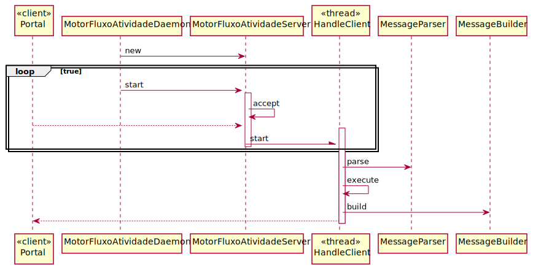

# US4002
=======================================

# 1. Requisitos

Como Gestor de Projeto, eu pretendo que o Motor de Fluxo de Atividades disponibilize, a pedido, os dados necessários às aplicações "Serviços e RH" e "Portal dos Utilizadores".

# 2. Análise

Com base na discussão com o cliente, reunimos as seguintes informações extras sobre esse recurso:

Os dados necessários serão dados necessários a visualizacao do dashboard e e informação estatística sobre o estado de execução dos pedidos em curso.

Dados necessários ao dashboard:
- número de tarefas pendentes ao Utilizador.
- quantas dessas tarefas já terminou o prazo limite de resolução indicado no pedido
- quantas terminam esse prazo em breve

# 3. Design

As principais perguntas são:

Como fornecemos a capacidade remota?

Como o Portal dos Utilizadores e Serviços e RH

Qual o protocolo de comunicação usar?

Esta funcionalidade vai ser fornecida como um "deamon" com um server sock , usando TCP como mecanismo de transporte. O Portal de Utilizadores vai precisar de conhecer este IP e porta.

## 3.1. Realização da Funcionalidade

## 3.2. Diagrama de Classes

## 3.3. Padrões Aplicados

*Nesta secção deve apresentar e explicar quais e como foram os padrões de design aplicados e as melhores práticas.*

## 3.4. Testes
*Nesta secção deve sistematizar como os testes foram concebidos para permitir uma correta aferição da satisfação dos requisitos.*

# 4. Implementação

# 5. Integração/Demonstração

# 6. Observações
